AWS로 운영하면서 cloudfront 연동을 별로 해본적이 없었다.

때문에 다시 공부할겸 가장 기본적인 s3 hosting에 cloudfront를 연동하기를 해볼겸 개인블로그에 cloudfront를 연동했다.

어찌어찌 연결만 해둔 상태이기때문에 이 포스트를 보시는 분들은 참고만 해주시길 바랍니다.

## 1. 개념

> 참고 : https://www.slideshare.net/awskorea/route53-cloudfront-cdn-gsneotek

-   AWS CloudFront 서비스는 CDN(Content Delivery Network) 서비스이다.

-   CloudFront를 구성하게되면 캐시기반으로 AWS의 Edge서버들에 컨텐츠를 배포하게 되고, client의 지리적위치에 따라 가장 가까운 Edge에서 컨텐츠를 불러오기때문에 네트워크 경로의 최소화로 속도를 증가시키는 효과가 있다.

-   HTTPS를 지원한다.

-   404 등의 오류에 대해 커스텀이 가능하다.

-   CloudFront를 구성하는 것만으로도 보안서비스인 Amazon Sheild(Layer 3/4)와 Amazon WAF(Layer 7)의 효과를 볼 수 있으며, 설정에 따라 origin 보호를 할 수 있다.

## 2. 비용

> 참고 : https://docs.aws.amazon.com/ko_kr/AmazonCloudFront/latest/DeveloperGuide/CloudFrontPricing.html

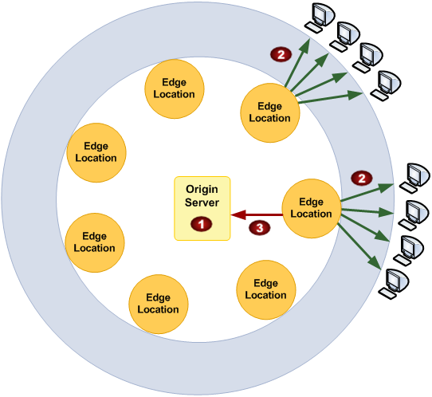

#### (1) Origin 저장 비용

-   S3 같은 컨텐츠를 저장하고있는 Origin의 기본 저장 비용

#### (2) 클라이언트 응답 비용 (Edge -> Internet)

> 대한민국 기준

-   처음 10TB까지는 **0.140 USD/GB**

-   이후 40TB까지는 **0.135 USD/GB** 등 많이 사용할 수록 GB당 비용 내려감

#### (3) Origin에 데이터 전송 (Edge -> Origin)

> 대한민국 기준

-   데이터 : **0.060 USD/GB**
-   요청수 : **(HTTP) 0.0090 USD , (HTTPS) 0.0120 USD / 10,000개**

## 3. CloudFront 생성 및 설정

### (1) Distributions 생성

AWS의 CloudFront 서비스에서 좌측 최상단 메뉴인 Distributions 에서 **Create Distributions를** 클릭한다.

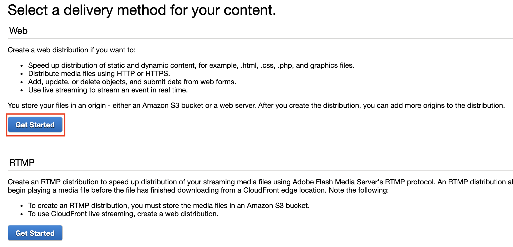

컨텐츠 전달 방법을 선택하는데 Web 과 RTMP 중에서 선택해야한다.

RTMP는 뭔지 모르겠으나 간단히 검색해보니 실시간 영상 전송에 많이 쓰이는 프로토콜인듯 하다.

난 내 블로그를 연결할 것이니 **Web**으로 선택.

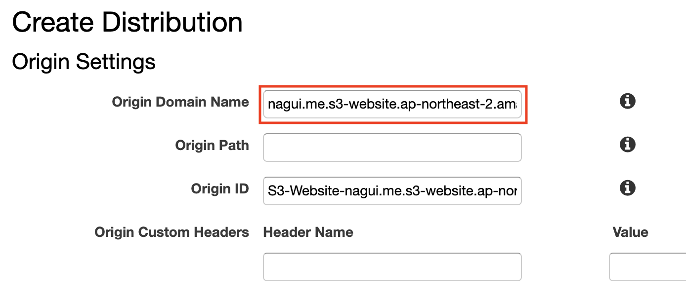

-   **Origin Domain Name :** origin의 Endpoint를 입력한다. 클릭시 자동완성 기능이 제공되는데, 나의 경우엔 따로 S3의 Hosting Endpoint를 입력했다. (이유는 아래에서..)

-   **Origin Path :** origin의 내부 디렉토리 중에 기본 경로를 따로 지정하고 싶다면 입력.

-   **Origin ID :** origin을 구별하는데 사용되는 설명의 일종으로 Origin Domain Name 입력시 자동으로 완성되며 수정 가능.

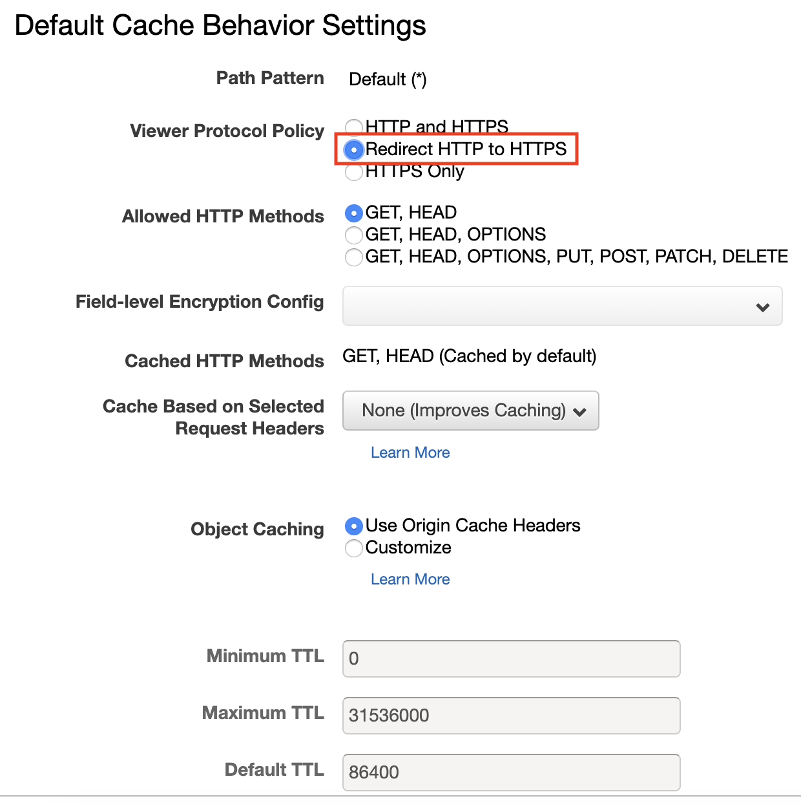

**Cache Behavior Settings**는 client의 request를 Path Pattern 별로 다른 설정을 할 수 있다.

나는 Default(\*) 패턴에서 **Viewer Protocol Policy**만 **Redirect HTTP to HTTPS** 로 설정했다.

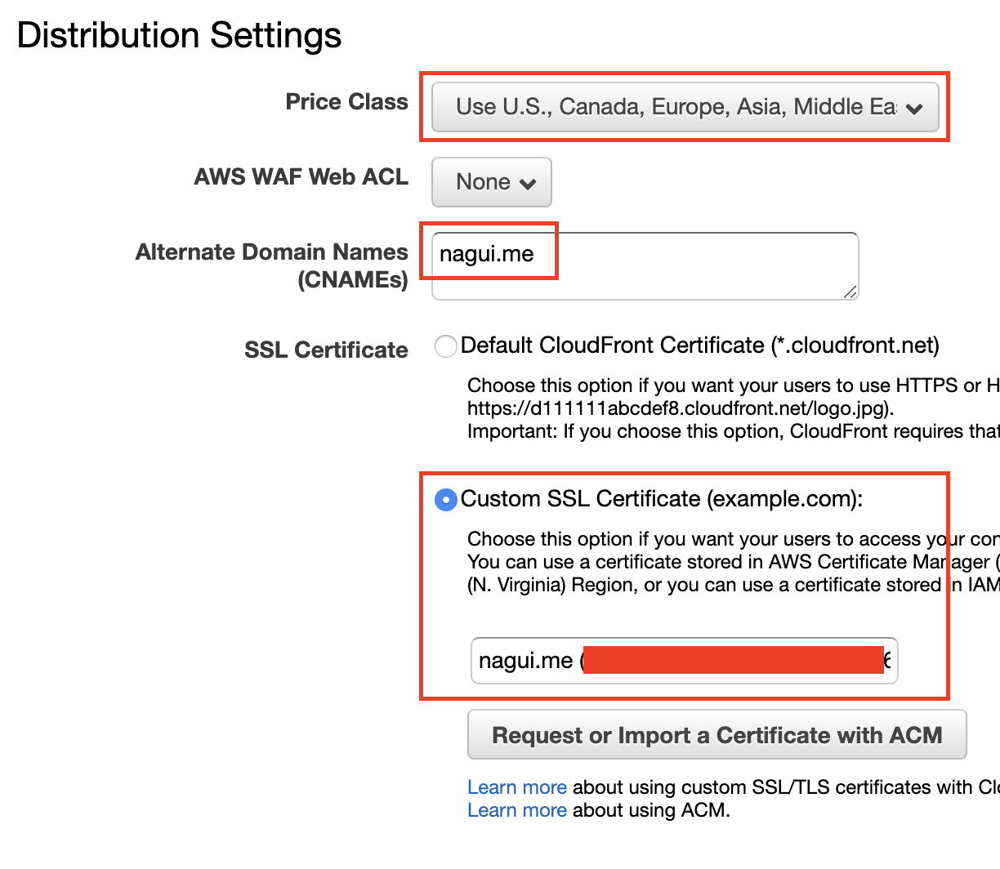

-   **Price Class :** 어느 리전 Edge에 배포할지 설정, Asia만 필수로 하고싶었기때문에 All이 아닌 Asia와 그 외 리전들이 묶여있는 옵션으로 선택했다.

-   **Alternate Domain Names :** 커스텀 도메인 이름 설정, 블로그의 도메인을 입력했다. 설정한다고 자동으로 DNS 설정까지 되는것은 아니기때문에 AWS Route53에서 추가적인 설정을 할 것이다.

-   **SSL Certificate :** 기본적으로 CloudFront에서 제공되는 SSL을 사용할 수도 있지만 만들어두었던 AWS ACM에서 생성한 인증서를 선택함.

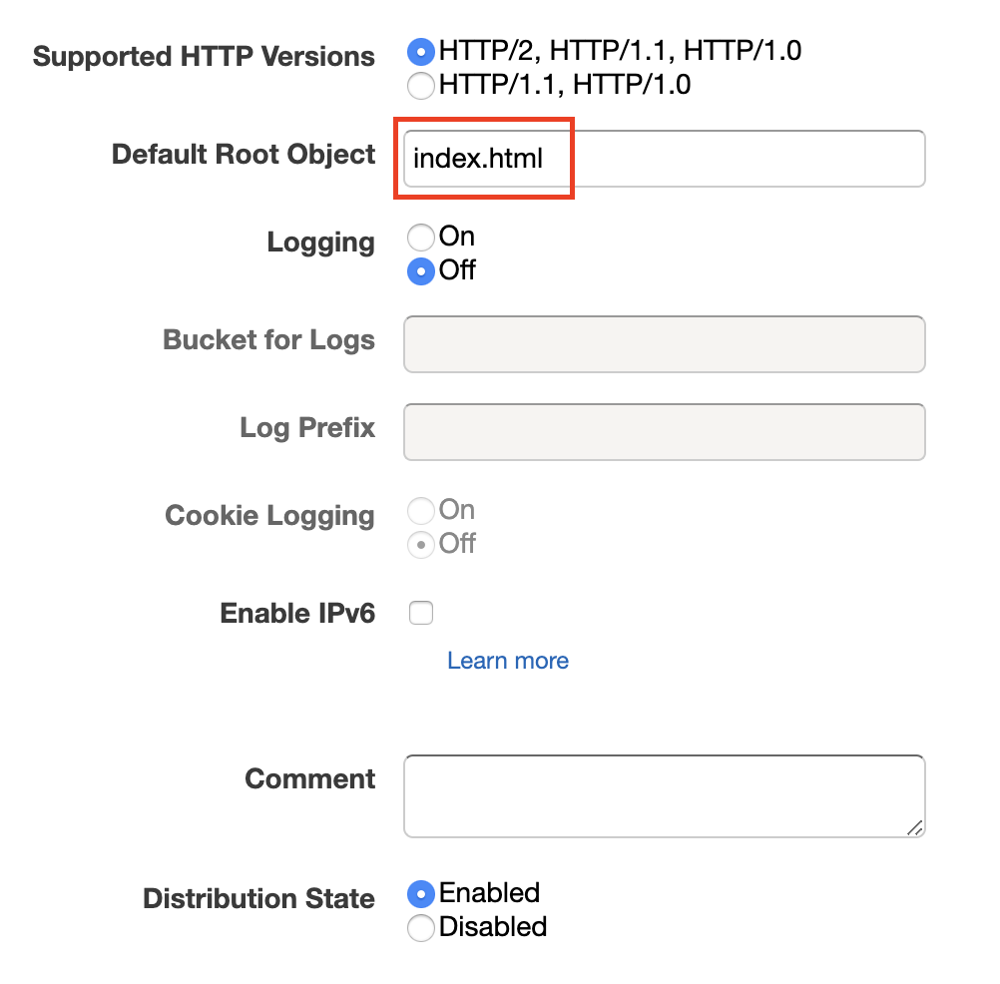

-   **Default Root Object :** 기본 최상위 객체, 설정하지 않으면 nagui.me 로 접속했을때 index.html 을 인식하지 못한다.

> 그 외 나머지 옵션들 전부 기본값

### (2) Error Page 설정

위에서 생성한 Distribution의 Error에 대한 응답을 설정.

설정하지 않으면 AWS의 Error Page가 뜨기때문에 해주는게 좋다고 한다.

> 생성한 Distribution 선택 -> Error Pages -> Create Custom Error Response 선택

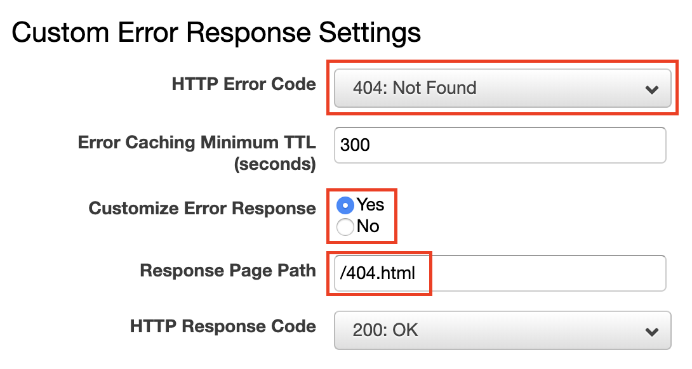

**404: Not Found**에 대한 에러 페이지를 설정했다.

## 4. Route 53 설정

CloudFront를 생성하면 아래와 같이 기본 도메인이 발급된다.

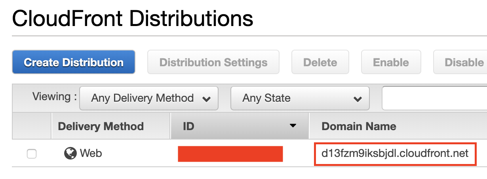

이 도메인을 실제 블로그 도메인인 **nagui.me**로 접속했을때 라우팅되도록 설정해야 한다.

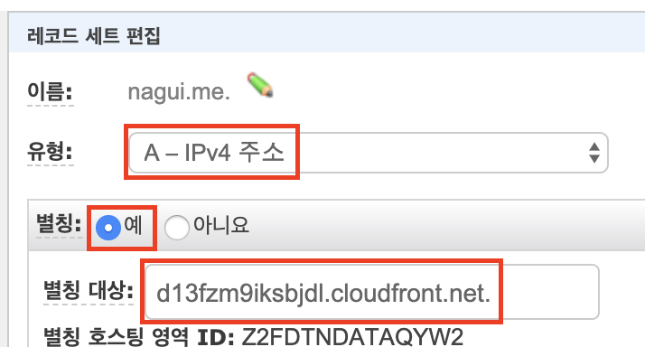

Route 53 에서 nagui.me 의 A 레코드를 CloudFront의 도메인으로 저장.

## 5. 문제 & 해결에 도움된 정보

### (1) cloudfront distribution 생성하고 나서 www.example.com이 index.html을 가리키지 않을 때

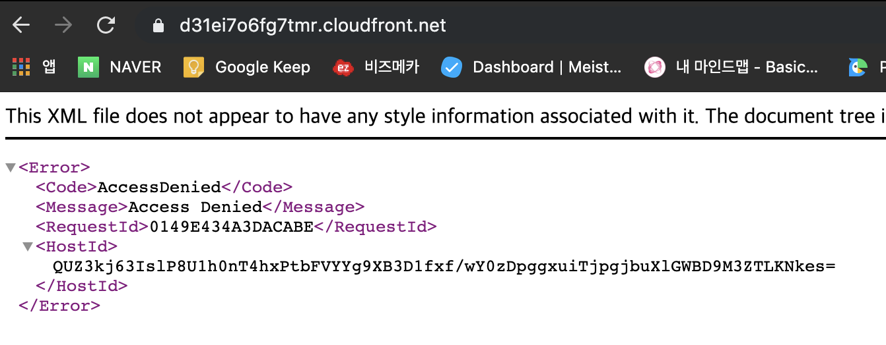

-   버킷정책 확인 : https://aws.amazon.com/ko/premiumsupport/knowledge-center/s3-website-cloudfront-error-403/

-   기본 루트 객체 지정 : https://docs.aws.amazon.com/ko_kr/AmazonCloudFront/latest/DeveloperGuide/DefaultRootObject.html

### (2) cloudfront distribution의 “Alternate Domain Names (CNAMEs)” 변경이 안될때

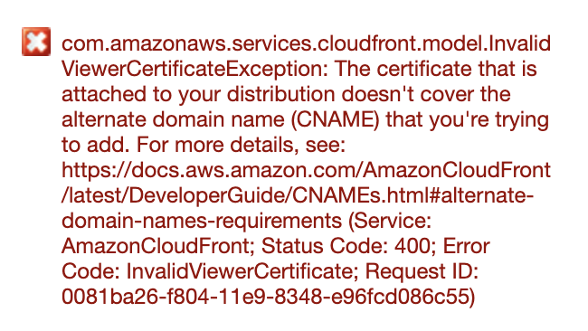

-   SSL인증서에 해당 도메인을 포함시켰는지 확인

### (3) 하위디렉토리의 빈경로에서 index.html을 가리키지 않을 때

-   호스팅된 S3의 주소를 Origin으로 설정 : https://stackoverflow.com/a/33087418

-   AWS Lambda를 이용해 라우팅 설정 : https://medium.com/@chrispointon/default-files-in-s3-subdirectories-using-cloudfront-and-lambda-edge-941100a3c629

## 6. 마무리

AWS 가이드와 구글링을 통해 연결은 했지만 아직 제대로 모르는 부분이 많다. 각 옵션에 대해서도, 캐쉬되는 객체에 대해서도..

실제 운영할때를 대비해 더 많이 알아둬야 겠다.
