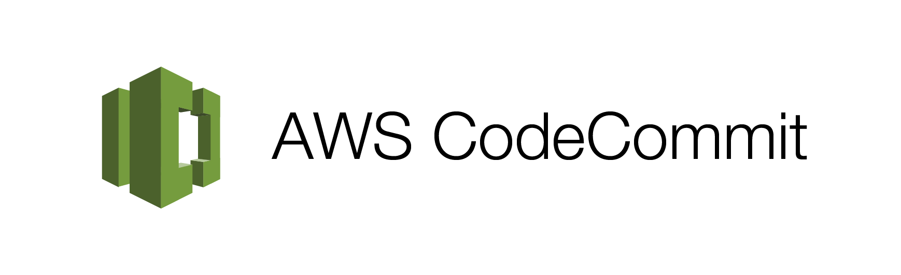
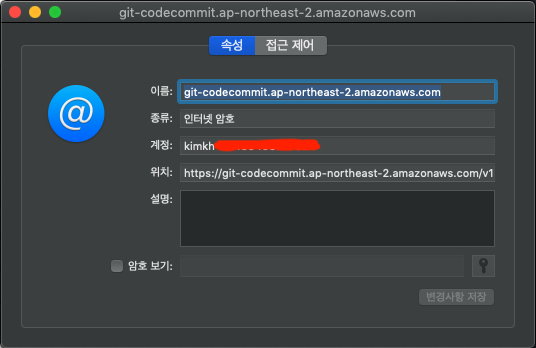

## Issue

-   기존 잘되던 프로젝트 디렉토리에서 **git pull**을 받으려고하니 갑자기 **unable to access 403** 에러 발생
-   **AWS CLI**로 자격증명을 하고 있었음
-   [[macos keychain 문제]](https://docs.aws.amazon.com/ko_kr/codecommit/latest/userguide/troubleshooting-ch.html#troubleshooting-macoshttps) 인듯함

## Solution

### :rocket: 급할때 임시 해결방법

-   사용자 홈디렉토리의 **.gitconfig** 와 프로젝트 디렉토리의 **.git/config** 에서 **[credential]** 항목 주석처리 후 재시도 [[링크]](https://docs.aws.amazon.com/ko_kr/codecommit/latest/userguide/troubleshooting-gc.html#troubleshooting-gc2)

### :star2: 해결방법

#### Option 1

-   git client 를 macos 의 **keychain** 을 사용하지않는 버전으로 재설치

#### Option 2

-   keychain 에서 **git-codecommit** 을 검색해서 문제되는 키를 찾고 **[정보 가져오기]** -> **[접근제어]** -> **[다음 응용프로그램에서 접근시 항상 허용]** 에서 **git-credential-osxkeychain**을 제거
-   다시 git 명령어 작업시 패스워드를 묻는 창이 뜰때 **거부** 선택
    :warning: 그러나 매번 창이 뜨기때문에 매번 거부를 선택해야 하는 불편함이 있음

#### Option 3 :dart:

> AWS CLI 자격증명이 아니라 Git 자격증명으로 대체하기

1. ~/.gitconfig 파일에 credential 항목을 아래와 같이 수정

```
...
[credential]
        helper = !aws codecommit credential-helper $@
        UseHttpPath = true
```

2. keychain 에서 **git-codecommit** 을 검색해서 해당되는 키를 삭제
3. 해당 프로젝트 디렉토리에서 git 명령 수행하면 묻는 Username과 Password 입력
4. keychain 에서 **git-codecommit** 을 검색해서 해당되는 키의 정보보기에서 **[계정]**항목이 키가 아니라 Username으로 되있다면 성공
   

## Conclusion

Codecommit 서비스사용시엔 AWS CLI 자격증명쓰지말자..
