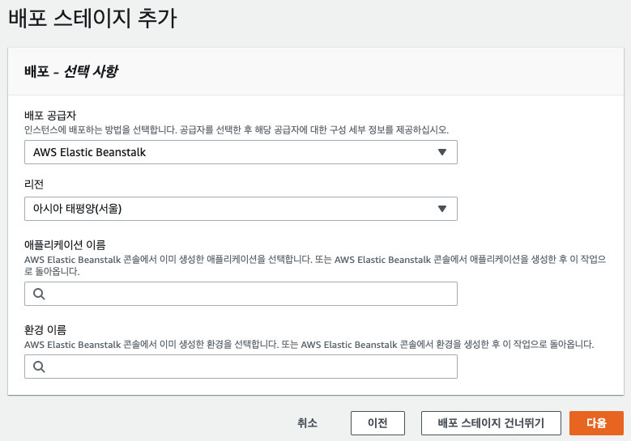

`AWS Codepipeline` 생성부터 `AWS CodeBuild`를 이용해서 빌드하고 `AWS ElasticBeanstalk`로 배포까지 과정을 설명해보겠다.

<!-- end -->

# 시리즈

1. **Elasticbeanstalk(Nodejs)를 Codepipeline으로 배포하기 (1) Codepipeline 생성과 설정**

2. <small>(작성예정)</small> Elasticbeanstalk(Nodejs)를 Codepipeline으로 배포하기 (2) Codebuild의 buildspec.yml

3. <small>(작성예정)</small> Elasticbeanstalk(Nodejs)를 Codepipeline으로 배포하기 (3) ElasticBeanstalk의 .ebextensions

---

> 파이프라인 이름, 리포지토리 이름 등의 정보는 임시로 여기 블로그 이름으로 지정하였습니다. 실제 이 블로그가 ElasticBeanstalk에 올라간 Nodejs 앱은 아닙니다.

## 1. Codepipeline 생성

### (1) 파이프라인 설정 선택

-   파이프라인 이름 : 단순히 파이프라인 구분을 위한 이름

-   서비스 역할 : Codepipeline에 부여될 역할(권한)

-   역할 이름 : "새 서비스 역할" 선택시 자동으로 설정됨

-   아티팩트 스토어 : Codepipeline 진행중 생성되는 아티팩트 (소스 압축파일, 빌드 압축파일 등) 를 저장할 S3 버킷

-   암호화 키 : 아티팩트 스토어의 데이터를 암호화하는데 쓰일 키

### (2) 소스 스테이지 추가

-   소스 공급자 : 소스 저장소 플랫폼 지정

-   리포지토리 : 저장소 플랫폼에서 내가 소유한 저장소 중 하나를 지정

-   브랜치 : 위에서 지정한 리포지토리의 브랜치 중 하나를 지정

-   변경 감지 옵션 : `웹후크(Webhook)`는 리포지토리의 해당 브랜치에 이벤트가 발생하면 AWS Codepipeline으로 이벤트가 전달되어 pipeline이 시작하는 방식이고, `AWS CodePieline`은 AWS에서 일정 시간 간격으로 지정된 브랜치에 변경사항이 있는지 체크하여 변경된 사항을 감지하면 pipeline을 시작하는 방식

### (3) 빌드 스테이지 추가

-   빌드 공급자 : 빌드 플랫폼으로 `Jenkins` 또는 `AWS CodeBuild` 중 선택

-   리전 : 현재 리전으로 자동 설정됨

-   프로젝트 이름 : 빌드 공급자를 `AWS CodeBuild` 선택시 생성되있는 Codebuild의 프로젝트를 선택하거나 새로 생성

-   환경변수 : 빌드 공급자를 `AWS CodeBuild` 선택시 빌드 환경의 환경변수를 설정

### (4) CodeBuild 프로젝트 생성

-   프로젝트 이름 : `AWS CodeBuild` 이름

-   환경 이미지 : `관리형 이미지`는 AWS에서 기본 제공하는 이미지, `사용자 지정 이미지`는 사용자가 원하는 빌드환경을 만들어둔 도커 이미지

-   운영체제 : `Amazon Linux 2` 또는 `Ubuntu` 중 선택

-   런타임 & 이미지 & 이미지버전 : 선택한 운영체제의 이미지 버전 선택

-   환경유형 : 기본 `Linux` 또는 `Linux GPU` 중 선택

-   서비스 역할 & 역할 이름 : 해당 CodeBuild를 수행할 IAM 역할(Role)을 지정

-   제한 시간 (& 대기 중인 제한 시간) : 설정된 제한 시간을 초과하면 빌드가 자동 실패함.

-   인증서 : 빌드과정에 인증서가 필요한 경우 설정

-   VPC : CodeBuild를 어느 VPC에서 진행할지 선택 (선택 안해도 됨)

-   컴퓨팅 : 빌드환경 사양 선택 (선택한 사양과 빌드시간에 따라 요금부과)

-   환경변수 : 해당 빌드환경의 환경변수 설정

-   Buildspec : (한국어 번역이 직역되어 사양이라고 되있지만 `빌드 스크립트`라는 표현이 더 맞는거 같다.) `buildspec 파일 사용` 선택하면 소스의 루트디렉토리에 `buildspec.yml` 파일을 읽어서 빌드를 수행하고, `빌드 명령 삽입`을 선택하면 AWS 콘솔에서 빌드 스크립트를 작성

-   로그 : `CloudWatch 로그` 선택시 빌드 로그가 Cloudwatch에 출력되고 아래에서 처럼 AWS CodeBuild에서도 로그 확인 가능

> 

### (5) 배포 스테이지 추가

-   배포 공급자 : 어디로 배포할 것인지 선택

-   리전 : 배포 공급자를 AWS 서비스 중 하나로 선택하면 현재 리전으로 자동 설정됨

-   애플리케이션 이름 : `AWS ElasticBeanstalk`에 생성되어있는 애플리케이션 중 선택

-   환경 이름 : 위에서 선택한 애플리케이션 안의 환경 중 선택

### (6) Codepipeline 생성 완료

