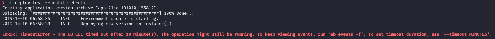
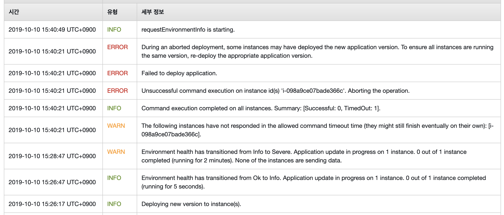
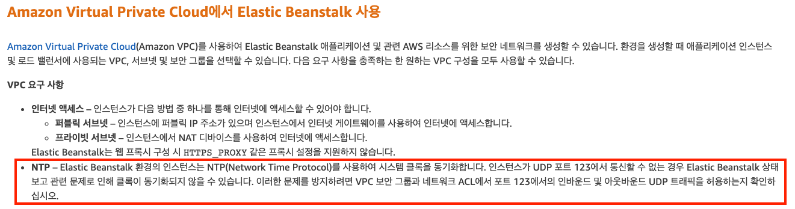
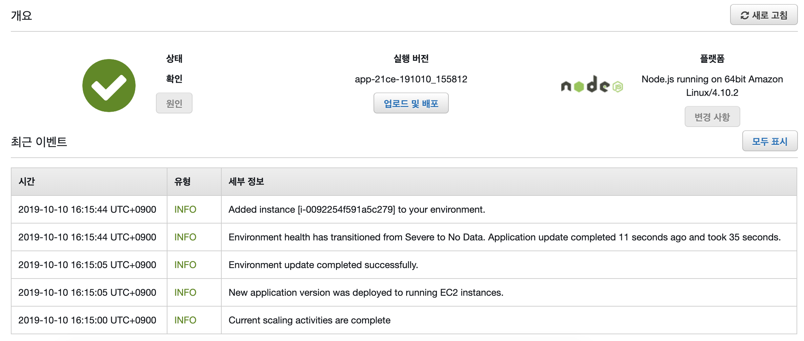

AWS EB 에 어플리케이션을 생성하고 test , staging , prod 환경을 구성한 후
local 에서 eb deploy 중 `None of the Instances are sending data` 라는 에러가 발생했다.

eb deploy 를 실행했던 터미널에서는 Timeout Error 발생





## 재현

```
# eb use test
# eb deploy test <— 성공
# eb use staging
# eb deploy staging <— 성공
# eb use test
# eb deploy test <— 실패
```

위와 같이 환경을 번갈아가며 배포를 시도할 때 에러가 났다.

왜 이런 걸까 … ???

## 1. NTP 통신 문제

https://code-examples.net/ko/q/1edd6c5


https://docs.aws.amazon.com/ko_kr/elasticbeanstalk/latest/dg/vpc.html


하지만 해당 보안그룹에 UDP 123 허용해도 안됨.

## 2. EC2 인스턴스 문제

`app + os + amazon tool 때문에 t2.micro 에서는 램부족이 일어날 수 있다` 라는 답변 발견
https://stackoverflow.com/questions/32364229/aws-none-of-the-instances-are-sending-data

설마 단순한 nodejs 앱 하나 띄우는건데…

일단 콘솔에서 t2.small 로 업데이트 실행

기존 버전을 다시 배포했다


**성 ㅡ 공**



공짜 프리티어 이용하려다가 금쪽같은 시간낭비했다…
