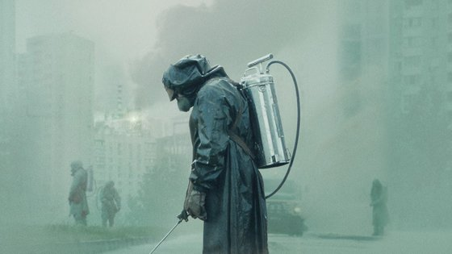
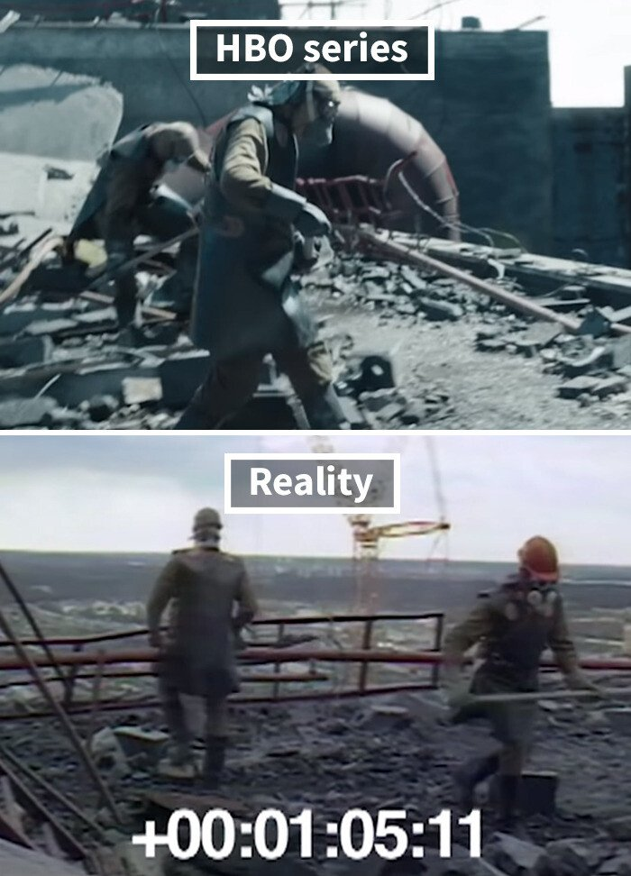
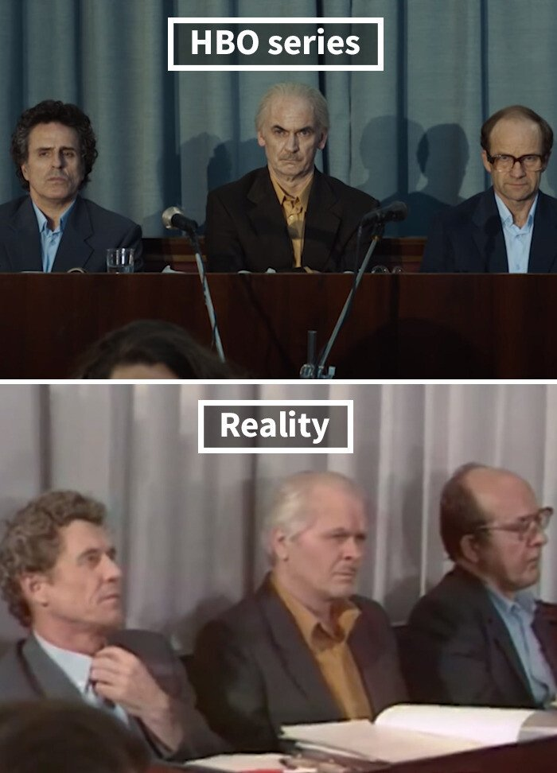

## HBO

2019년 5월에 방영되었던 미국 HBO의 5부작 미니시리즈 역사 드라마 **"체르노빌"**

최근 이 드라마를 보기전에는 체르노빌은 그냥 과거에 일어났던 원자력발전소 폭파 재난이 일어난 곳 정도로만 알고있었고,

이 드라마를 보기 시작한 것도 왕좌의 게임을 만들었던 HBO가 고증을 너무 잘했다는 인터넷 짤들을 보며 얼마나 잘만들었길래.. 라는 호기심 때문이었다.

## 체르노빌 사건이란

1986년 4월 26일 01시 24분 (모스크바 기준) 체르노빌 원자력 발전소에서 폭발이 발생했다.

원자로의 노심이 절대 폭발할리 없다는 이론에만 근거하여 소장은 단순히 발전소 건물의 지붕에서 발생한 화재로 치부하였고 최대 측정치가 낮은 방사능측정기를 기준으로 상부에 보고하여 이미 다른 나라들로 소량의 방사능이 퍼진 이후에나 대처를 시작했다.

자세한 내용은 스포이기 때문에 적지 않고 드라마이기 때문에 과장된 부분이 있을 수 있지만 자칫 잘못하면 전세계가 방사능으로 뒤덮일뻔했던 이 사고가 전부 몇몇사람의 욕심 때문이라는 것에 시청자의 입장인데도 매우 답답하고 화가 났다. (배우들의 연기력과 제작진의 연출력이 너무 뛰어난 것 같다)

## 게임 폴아웃이 생각나더라

이 드라마를 시청하면서 매우 익숙한 소리를 들을 수 있었다.

등장인물들이 방사능복을 입고 피폭지점에 가까이 갈수록 점점 크게 들리는 소리, 뜨뜨뜨뜨 하면서 잡음처럼 들리는 소리가 바로 **GM계수관**에서 나는 소리인데 

게임을 할때 아주 많이 들었지만 게임이라 무섭거나 긴장되기보다는 단순한 알림정도로 생각했었다.

하지만 이 드라마에서 사고현상 수습을 위해 투입된 인원들의 시점에서 이 소리를 들으니 정말 긴장되고 당사자들은 얼마나 무서웠을까 라는 생각이 들더라..

욕심때문에 사고친 사람 따로.. 목숨걸고 수습하는 사람 따로.. 

## 방사능이나 욕심이나 한번 퍼지면..

군대에서 배웠었지만 다시 한번 방사능의 무서움에 대해 생각하게 되는 드라마.

높은 자리에 있을수록 욕심에 먹히면 안된다는 걸 보여주는 드라마.