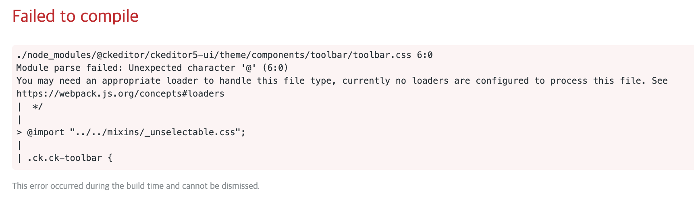
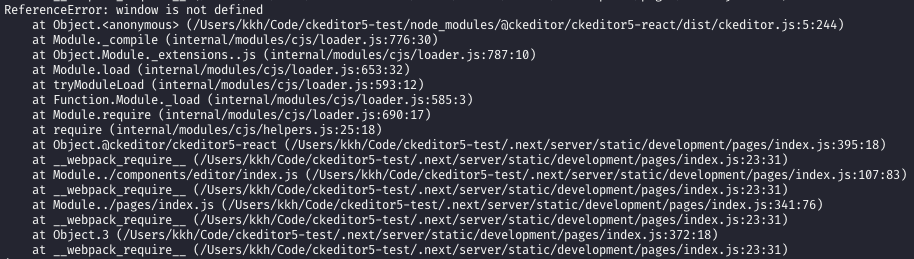
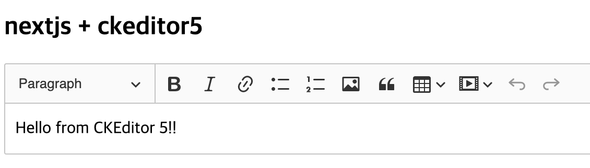
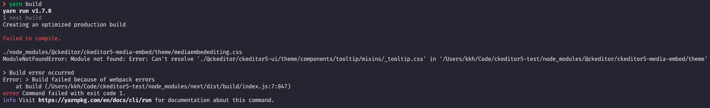
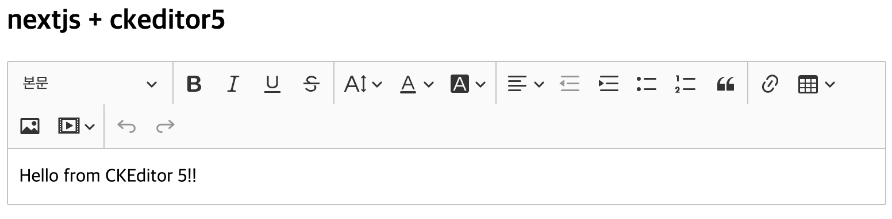
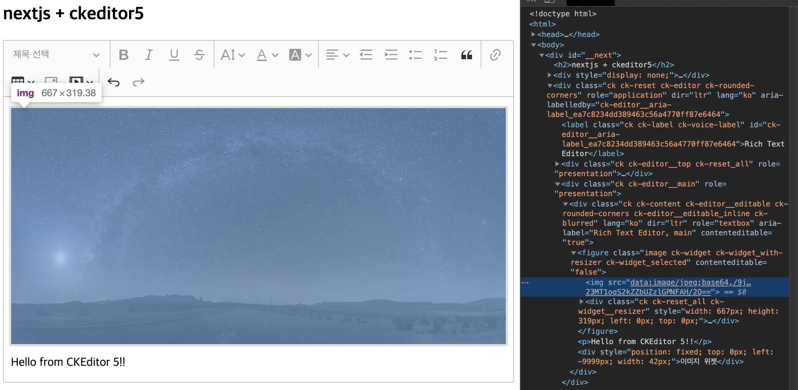

과거 react 프로젝트를 할때 ckeditor5 붙이는 작업을 했었는데 webpack 지원이 미완성일때라 에디터를 커스텀하려면 따로 저장소를 만들어서 빌드한 결과물을 사용해야 했었다.

plugin 등을 수정할때마다 재빌드해서 업로드해야하는 수고스러움이 좀 컸었다.

그런데 최근 ckeditor5 를 다시 보니 webpack 지원이 잘되어서 조금만 설정하면 소스에서 실시간으로 수정작업을 할 수 있다고 해서 nextjs9 에 붙여봣다.

## 1. create-next-app 프로젝트 생성

`create-next-app` 을 이용해서 nextjs 프로젝트를 생성한다.

```
# create-next-app ckeditor5-test
Creating a new Next.js app in /Users/kkh/Code/ckeditor5-test.

Installing react, react-dom, and next using yarn...
...
```

## 2. Ckeditor5 컴포넌트 만들기

일단 기본적인 classic editor 로 생성해보자.

### (1) 패키지 설치

```
# yarn add @ckeditor/ckeditor5-react @ckeditor/ckeditor5-build-classic
```

### (2) 컴포넌트 생성

```js
// components/editor/index.js
import { Component } from "react";
import CKEditor from "@ckeditor/ckeditor5-react";
import ClassicEditor from "@ckeditor/ckeditor5-build-classic";

class App extends Component {
    render() {
        return (
            <CKEditor
                data="<p>Hello from CKEditor 5!!</p>"
                onInit={editor =>
                    console.log("Editor is ready to use!", editor)
                }
                onChange={(event, editor) => {
                    console.log("Change", { event, editor });
                }}
                onBlur={(event, editor) => {
                    console.log("Blur.", { event, editor });
                }}
                onFocus={(event, editor) => {
                    console.log("Focus.", { event, editor });
                }}
                editor={ClassicEditor}
            />
        );
    }
}

export default App;
```

### (3) index에 붙이기

```js
// pages/index.js
import React from "react";
import Editor from "../components/editor";

const Home = () => {
    return (
        <>
            <h2>nextjs + ckeditor5</h2>
            <Editor />
        </>
    );
};

export default Home;
```

## 3. 기본 에디터 에러 처리하기

### (1) css

이제 프로젝트를 실행해보면 아래와 같은 에러가 난다.



css 파일을 못읽으니 webpack 설정을 해주자.

```
# yarn add @zeit/next-css next-images
```

> @zeit/next-css 만 설치하면 next-images 가 없다고 에러남

```js
// next.config.js
const withImages = require("next-images");
const withCSS = require("@zeit/next-css");

module.exports = withCSS(
    withImages({
        webpack(config, options) {
            return config;
        }
    })
);
```

### (2) window is not defined

css 에러를 해결하고나면 서버콘솔에서 window 객체 를 찾을 수 없다고 나오는데,



nextjs는 기본적으로 ssr을 지원하는데 ckeditor5가 window 객체를 무조건 필요로 하기때문에 에러가 난다.

때문에 ckeditor는 client에서만 렌더링되도록 수정하자.

```js
import React from "react";
import dynamic from "next/dynamic";
const Editor = dynamic(() => import("../components/editor"), {
    ssr: false
});

const Home = () => {
    return (
        <>
            <h2>nextjs + ckeditor5</h2>
            <Editor />
        </>
    );
};

export default Home;
```

이제 실행하면 정상적으로 나온다.



## 4. 커스터마이징 하기

대부분의 사용자는 위의 에디터 기능으로는 부족함을 느낄 것이므로 다른 기능들을 추가해보자.

### (1) 패키지 설치

기본 classic 에디터에 있는 기능이라도 커스텀해야하기 때문에 모든 기능을 다 설치해주어야 한다.

> [공식 홈페이지](https://ckeditor.com/docs/ckeditor5/latest/features/index.html)에 각 기능에 대한 설명이 데모와 함께 잘 나와있다.

```
# yarn remove @ckeditor/ckeditor5-build-classic
# yarn add @ckeditor/ckeditor5-editor-classic @ckeditor/ckeditor5-essentials @ckeditor/ckeditor5-paragraph @ckeditor/ckeditor5-basic-styles @ckeditor/ckeditor5-block-quote @ckeditor/ckeditor5-link @ckeditor/ckeditor5-media-embed @ckeditor/ckeditor5-paste-from-office @ckeditor/ckeditor5-heading @ckeditor/ckeditor5-font @ckeditor/ckeditor5-image @ckeditor/ckeditor5-list @ckeditor/ckeditor5-alignment @ckeditor/ckeditor5-table @ckeditor/ckeditor5-typing @ckeditor/ckeditor5-indent @ckeditor/ckeditor5-upload @ckeditor/ckeditor5-theme-lark
```

### (2) 에디터 수정

```js
// components/editor/index.js
import React, { Component } from "react";
import CKEditor from "@ckeditor/ckeditor5-react";
import ClassicEditor from "@ckeditor/ckeditor5-editor-classic/src/classiceditor";
import Essentials from "@ckeditor/ckeditor5-essentials/src/essentials";
import Paragraph from "@ckeditor/ckeditor5-paragraph/src/paragraph";
import Bold from "@ckeditor/ckeditor5-basic-styles/src/bold";
import Italic from "@ckeditor/ckeditor5-basic-styles/src/italic";
import Underline from "@ckeditor/ckeditor5-basic-styles/src/underline";
import Strikethrough from "@ckeditor/ckeditor5-basic-styles/src/strikethrough";
import BlockQuote from "@ckeditor/ckeditor5-block-quote/src/blockquote";
import Link from "@ckeditor/ckeditor5-link/src/link";
import MediaEmbed from "@ckeditor/ckeditor5-media-embed/src/mediaembed";
import PasteFromOffice from "@ckeditor/ckeditor5-paste-from-office/src/pastefromoffice";
import Heading from "@ckeditor/ckeditor5-heading/src/heading";
import Font from "@ckeditor/ckeditor5-font/src/font";
import Image from "@ckeditor/ckeditor5-image/src/image";
import ImageStyle from "@ckeditor/ckeditor5-image/src/imagestyle";
import ImageToolbar from "@ckeditor/ckeditor5-image/src/imagetoolbar";
import ImageUpload from "@ckeditor/ckeditor5-image/src/imageupload";
import ImageResize from "@ckeditor/ckeditor5-image/src/imageresize";
import List from "@ckeditor/ckeditor5-list/src/list";
import Alignment from "@ckeditor/ckeditor5-alignment/src/alignment";
import Table from "@ckeditor/ckeditor5-table/src/table";
import TableToolbar from "@ckeditor/ckeditor5-table/src/tabletoolbar";
import TextTransformation from "@ckeditor/ckeditor5-typing/src/texttransformation";
import Indent from "@ckeditor/ckeditor5-indent/src/indent";
import IndentBlock from "@ckeditor/ckeditor5-indent/src/indentblock";
import Base64UploadAdapter from "@ckeditor/ckeditor5-upload/src/adapters/base64uploadadapter";

class App extends Component {
    render() {
        return (
            <CKEditor
                data="<p>Hello from CKEditor 5!!</p>"
                onInit={editor =>
                    console.log("Editor is ready to use!", editor)
                }
                onChange={(event, editor) => {
                    console.log("Change", { event, editor });
                }}
                onBlur={(event, editor) => {
                    console.log("Blur.", { event, editor });
                }}
                onFocus={(event, editor) => {
                    console.log("Focus.", { event, editor });
                }}
                config={{
                    plugins: [
                        Essentials,
                        Paragraph,
                        Bold,
                        Italic,
                        Heading,
                        Indent,
                        IndentBlock,
                        Underline,
                        Strikethrough,
                        BlockQuote,
                        Font,
                        Alignment,
                        List,
                        Link,
                        MediaEmbed,
                        PasteFromOffice,
                        Image,
                        ImageStyle,
                        ImageToolbar,
                        ImageUpload,
                        ImageResize,
                        Base64UploadAdapter,
                        Table,
                        TableToolbar,
                        TextTransformation
                    ],
                    toolbar: [
                        "heading",
                        "|",
                        "bold",
                        "italic",
                        "underline",
                        "strikethrough",
                        "|",
                        "fontSize",
                        "fontColor",
                        "fontBackgroundColor",
                        "|",
                        "alignment",
                        "outdent",
                        "indent",
                        "bulletedList",
                        "numberedList",
                        "blockQuote",
                        "|",
                        "link",
                        "insertTable",
                        "imageUpload",
                        "mediaEmbed",
                        "|",
                        "undo",
                        "redo"
                    ],
                    heading: {
                        options: [
                            {
                                model: "paragraph",
                                view: "p",
                                title: "본문",
                                class: "ck-heading_paragraph"
                            },
                            {
                                model: "heading1",
                                view: "h1",
                                title: "헤더1",
                                class: "ck-heading_heading1"
                            },
                            {
                                model: "heading2",
                                view: "h2",
                                title: "헤더2",
                                class: "ck-heading_heading2"
                            },
                            {
                                model: "heading3",
                                view: "h3",
                                title: "헤더3",
                                class: "ck-heading_heading3"
                            }
                        ]
                    },
                    fontSize: {
                        options: [
                            9,
                            10,
                            11,
                            12,
                            13,
                            14,
                            15,
                            16,
                            17,
                            18,
                            19,
                            20,
                            21,
                            23,
                            25,
                            27,
                            29,
                            31,
                            33,
                            35
                        ]
                    },
                    alignment: {
                        options: ["justify", "left", "center", "right"]
                    },
                    table: {
                        contentToolbar: [
                            "tableColumn",
                            "tableRow",
                            "mergeTableCells"
                        ]
                    },
                    image: {
                        resizeUnit: "px",
                        toolbar: [
                            "imageStyle:alignLeft",
                            "imageStyle:full",
                            "imageStyle:alignRight",
                            "|",
                            "imageTextAlternative"
                        ],
                        styles: ["full", "alignLeft", "alignRight"]
                    },
                    typing: {
                        transformations: {
                            remove: [
                                "enDash",
                                "emDash",
                                "oneHalf",
                                "oneThird",
                                "twoThirds",
                                "oneForth",
                                "threeQuarters"
                            ]
                        }
                    }
                }}
                editor={ClassicEditor}
            />
        );
    }
}

export default App;
```

## 5. 커스텀 에디터 에러 처리하기

위에서 수정한데로 프로젝트를 실행하면 실행도 안되고, 빌드하면 아래와 같이 에러가 뜰 것이다.



이것도 결국 webpack 처리를 해줘야한다.

> [공식홈페이지 Advanced setup 방법](https://ckeditor.com/docs/ckeditor5/latest/builds/guides/integration/advanced-setup.html#scenario-2-building-from-source)

### webpack 설정

공식홈페이지의 예제에서 보면 webpack 설정이 크게 3가지 처리를 해준다.

1. 언어
2. svg
3. css

**그런데 nextjs 는 자체 webpack 처리를 해주고 있으므로 겹치지 않게 해주는게 중요했다.**

### (1) 필요한 패키지를 설치

```
# yarn add --dev raw-loader @ckeditor/ckeditor5-dev-webpack-plugin @ckeditor/ckeditor5-dev-utils
```

### (2) 언어 변경 처리

```js
// next.config.js
...
webpack(config, options) {
    config.plugins.push(new CKEditorWebpackPlugin({ language: "ko" }));
    return config;
}
...
```

```js
// components/editor/index.js
...
<CKEditor
    ...
    config={{
        ...
        language: "ko"
    }}
    ...
/>
...
```

### (3) svg & css 처리

이부분이 위에서 말했던 nextjs 의 기본 webpack 설정과 충돌나면 안되는 부분이라 먼저 nextjs의 webpack 설정은 어떻게 되있나 보자.

```js
// next.config.js
const CKEditorWebpackPlugin = require("@ckeditor/ckeditor5-dev-webpack-plugin");
...
webpack(config, options) {
    config.plugins.push(new CKEditorWebpackPlugin({ language: "ko" }));
    console.log(config.module.rules) // <- 추가
    return config;
}
...
```

프로젝트를 실행해보면 서버콘솔에 아래와 같이 나온다.

```json
[ { test: /\.(tsx|ts|js|mjs|jsx)$/,
    include:
     [ '/Users/kkh/Code/ckeditor5-test',
       /next[\\\/]dist[\\\/]next-server[\\\/]lib/,
       /next[\\\/]dist[\\\/]client/,
       /next[\\\/]dist[\\\/]pages/,
       /[\\\/](strip-ansi|ansi-regex)[\\\/]/ ],
    exclude: [Function: exclude],
    use: { loader: 'next-babel-loader', options: [Object] } },
  { test: /\.css$/,
    use:
     [ 'extracted-loader',
       '/Users/kkh/Code/ckeditor5-test/node_modules/mini-css-extract-plugin/dist/loader.js',
       [Object] ] },
  { test: /\.(jpe?g|png|svg|gif|ico|webp)$/,
    exclude: undefined,
    use: [ [Object] ] } ]
[ { test: /\.(tsx|ts|js|mjs|jsx)$/,
    include:
     [ '/Users/kkh/Code/ckeditor5-test',
       /next[\\\/]dist[\\\/]next-server[\\\/]lib/,
       /next[\\\/]dist[\\\/]client/,
       /next[\\\/]dist[\\\/]pages/,
       /[\\\/](strip-ansi|ansi-regex)[\\\/]/ ],
    exclude: [Function: exclude],
    use: { loader: 'next-babel-loader', options: [Object] } },
  { test: /\.css$/, use: [ 'ignore-loader' ] },
  { test: /\.(jpe?g|png|svg|gif|ico|webp)$/,
    exclude: undefined,
    use: [ [Object] ] } ]
```

보면 역시 이미 svg와 css를 처리하는 부분이 들어가 있다.

이 부분을 피해서 필요한 설정을 넣자.

```js
// next.config.js
const { styles } = require("@ckeditor/ckeditor5-dev-utils");
...
webpack(config, options) {
    ...
    // 1. 기존 nextjs webpack 처리를 ckeditor에서 처리할 부분을 제외하고 할 수 있도록 설정
    config.module.rules.forEach(function(rule, index, array) {
        const test = rule.test.toString();
        if (test.includes("css")) {
            array[index] = {
                ...rule,
                exclude: /ckeditor5-[^/]+\/theme\/[\w-/]+\.css$/
            };
        } else if (test.includes("svg")) {
            array[index] = {
                ...rule,
                exclude: /ckeditor5-[^/]+\/theme\/icons\/.+\.svg$/
            };
        }
    });

    // 2. ckeditor css 처리
    config.module.rules.push({
        test: /ckeditor5-[^/]+\/theme\/[\w-/]+\.css$/,
        use: [
            {
                loader: "style-loader",
                options: {
                    injectType: "singletonStyleTag"
                }
            },
            {
                loader: "postcss-loader",
                options: styles.getPostCssConfig({
                    themeImporter: {
                        themePath: require.resolve("@ckeditor/ckeditor5-theme-lark")
                    },
                    minify: true
                })
            }
        ]
    });

    // 3. ckeditor svg 처리
    config.module.rules.push({
        test: /ckeditor5-[^/]+\/theme\/icons\/.+\.svg$/,
        use: ["raw-loader"]
    });

    return config;
}
...
```

## 6. 완성

이제 실행해보면 아래와 같이 잘 나온다.





## 7. ckeditor5 아쉬운 점

오픈소스 중에 사용자도 많고 기능도 많고 5버전으로 업데이트되면서 UI도 깔끔하고 여러 프레임워크에 붙이기 쉬워졌지만, 4버전에 비해 좀 아쉬워진 점이 있다.

1. **"소스 보기 및 수정"** 기능 없음.

2. **"색상코드"** 지정할 수 없음.

3. **"이미지에 링크"**를 걸 수 없음.

4. 아직 미흡한 **"한국어"**.
