지난 포스트([nextjs + ckeditor5 custom build](http://nagui.me/javascript/nextjs9_ckeditor5/))에 이어 이번엔 ckeditor5 에서 이미지 업로드 구현을 포스팅한다.

기본적으로 아무 설정 안해도 ckeditor5 에서는 이미지가 base64 포맷으로 업로드된다.

하지만 이러면 데이터베이스상으로도 사용자 입장에서도 문제가 많기 때문에 별도의 파일스토리지로 이미지를 업로드하는게 일반적이다.

ckeditor는 ckfinder나 easyimage 같은 유료서비스를 제공하고 이를 사용하면 아주 쉽게 이미지 업로드를 구현할 수 있지만 역시 그만큼 돈이 지불된다.

마침 AWS 를 쓰고 있으니 S3 에 이미지를 업로드하는 걸 테스트해보고자 한다.

## 1. AWS S3 + IAM

먼저 이미지가 저장될 AWS S3 버킷을 만들고,

아무나 접근은 가능하지만 업로드는 권한을 부여받은 IAM 유저만 가능하도록 설정해야한다.

#### (1) AWS S3 버킷 생성 및 정책 설정

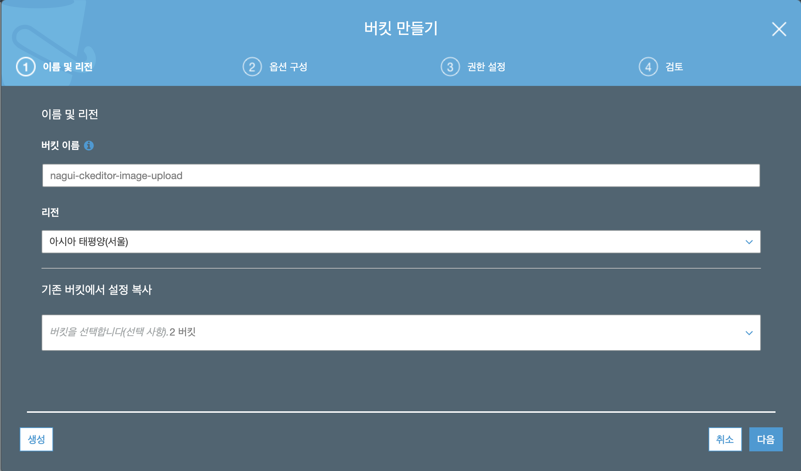
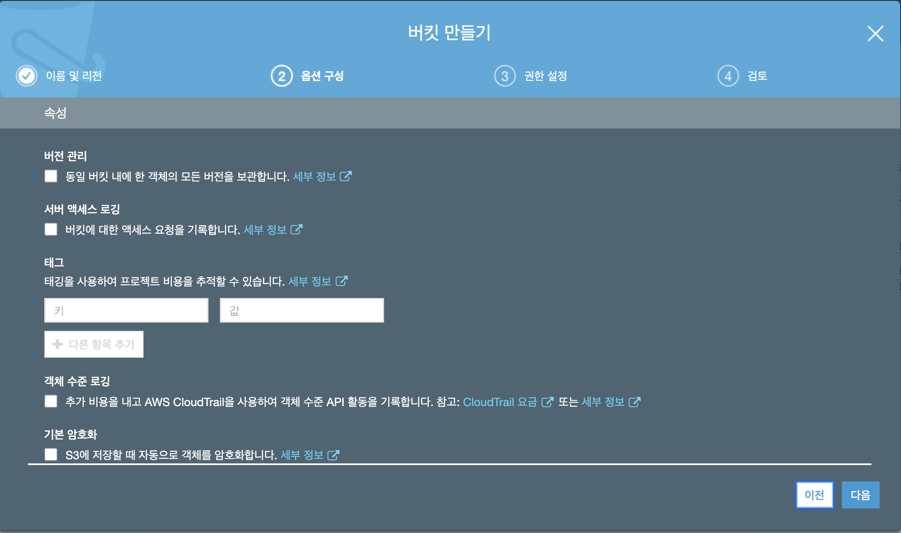
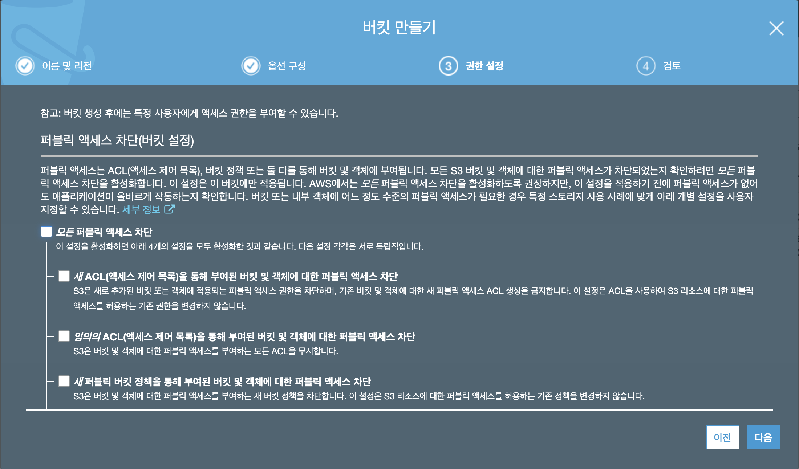
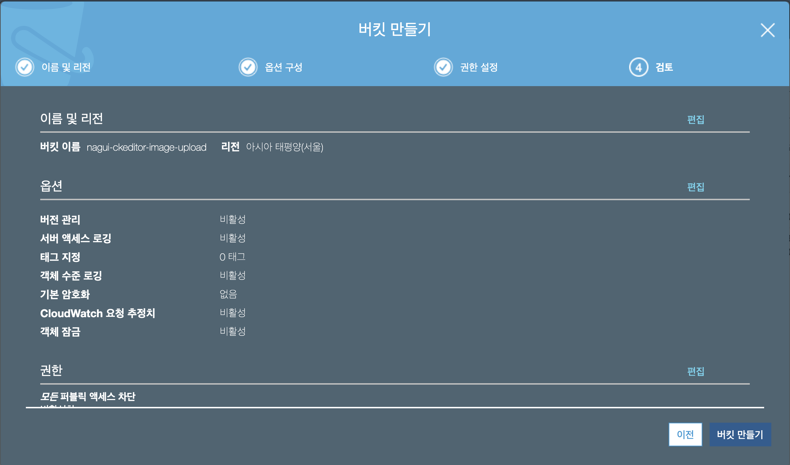
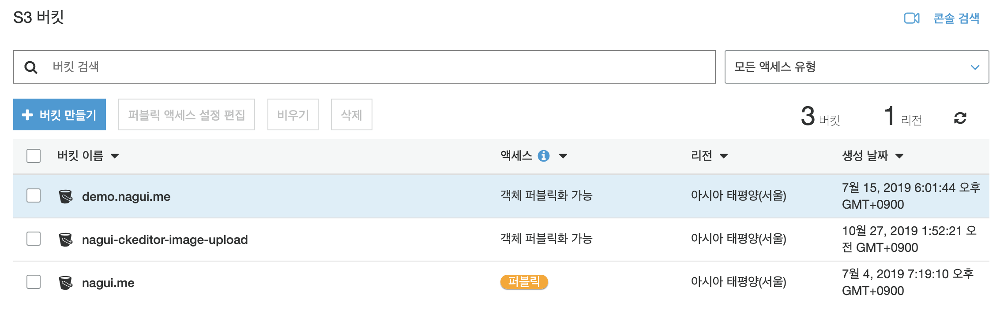

간단하게 이름지정하고 퍼블릭 엑세스 차단만 비활성화 시켜준다.

```json
{
    "Version": "2012-10-17",
    "Statement": [
        {
            "Effect": "Allow",
            "Principal": "*",
            "Action": "s3:GetObject",
            "Resource": "arn:aws:s3:::nagui-ckeditor-image-upload/*"
        }
    ]
}
```

버킷 정책은 모든 사람들이 객체를 볼 수 있도록 한다.

여기서 중요한 것은 `"Resource": "YOUR-BUCKET-ARN/*"` 에서 뒷부분의 `/*` 을 잊지 말아야 한다.

#### (2) AWS IAM 유저 생성 및 권한부여

아무나 이미지를 읽기는 가능하지만 아무나 업로드, 수정, 삭제 등 쓰기작업이 가능하게 해선 안된다.

때문에 별도의 IAM 유저를 만들어서 해당 유저에만 쓰기권한을 부여할 것이다.

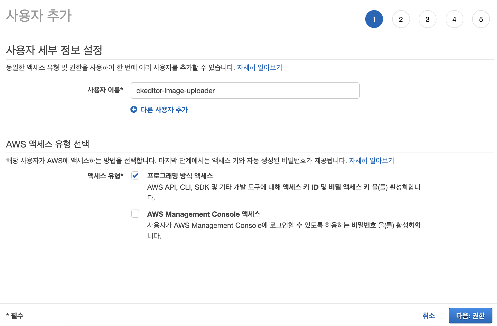

엑세스 유형은 `프로그래밍 방식 엑세스`만 선택하고

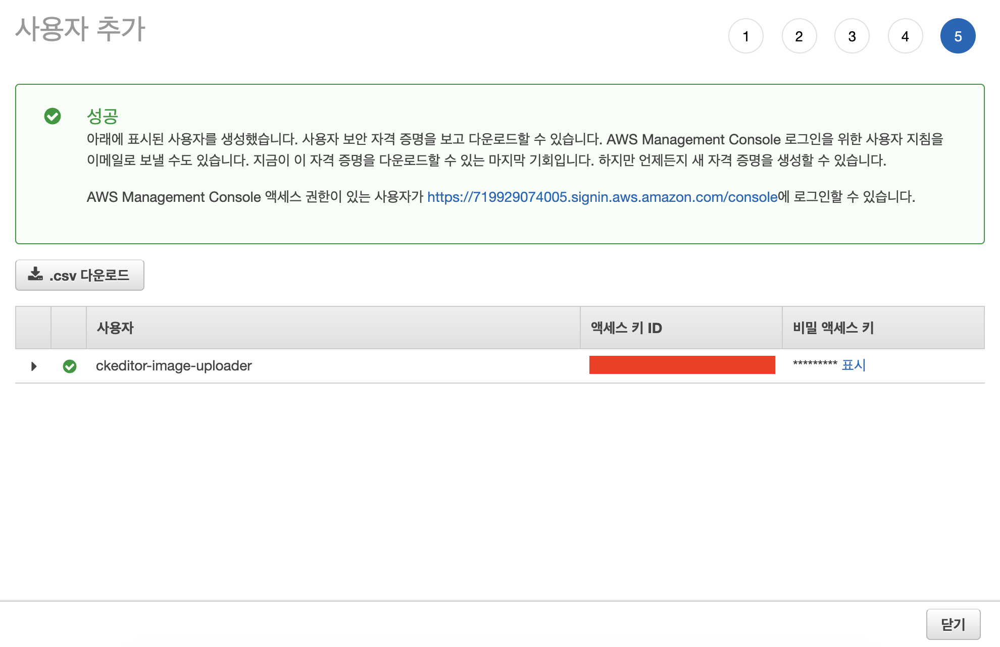

다음으로 계속 넘기다가 `"액세스 키 ID"와 "비밀 엑세스키"`가 나올때 잘 복사하거나 csv를 다운로드 해둔다.

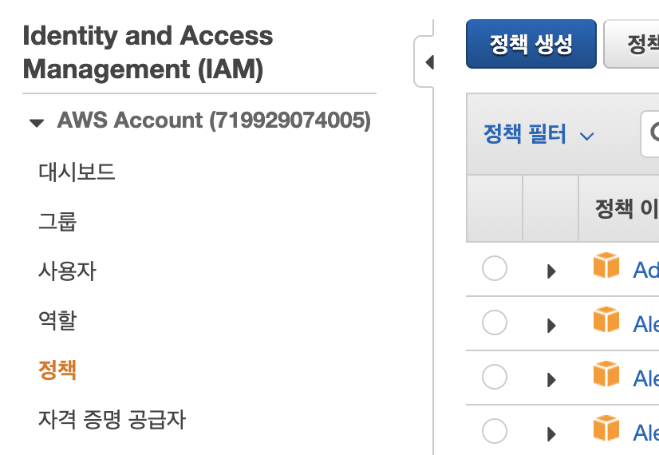

이제 IAM 유저는 생성이 되었으므로 이 유저에 연결할 정책을 만들어야 한다.

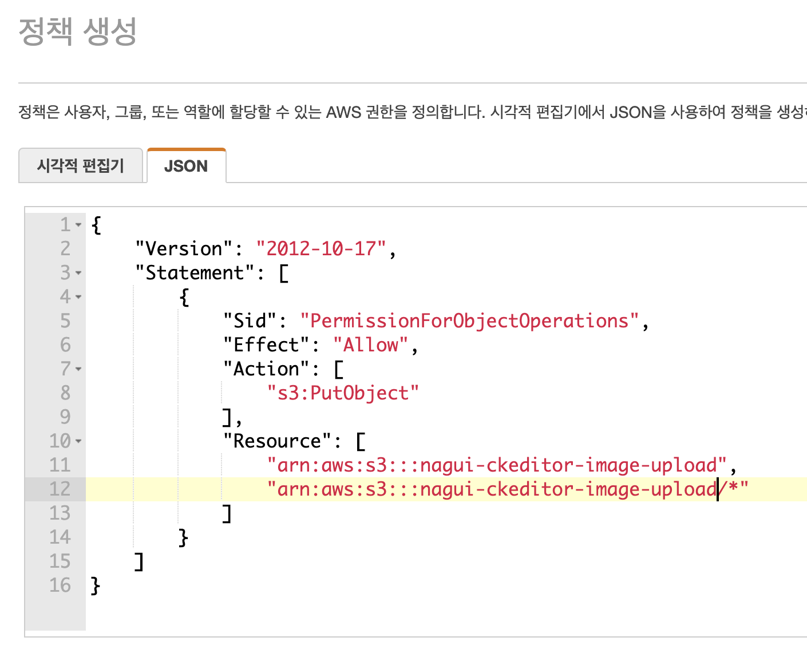

JSON 형식으로 정책을 입력하고

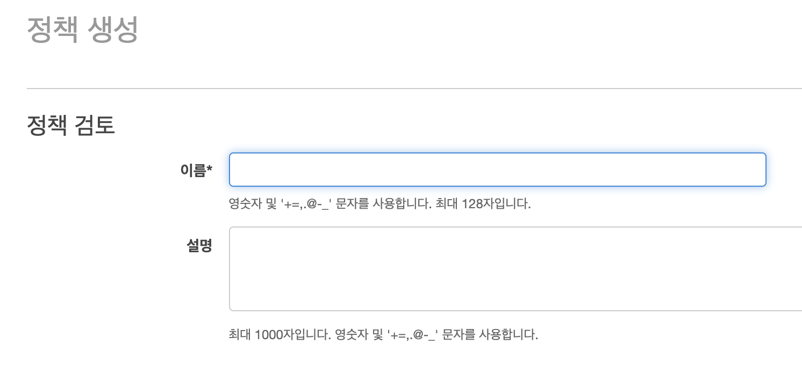

정책의 이름을 입력해서 정책 생성을 완료한다.

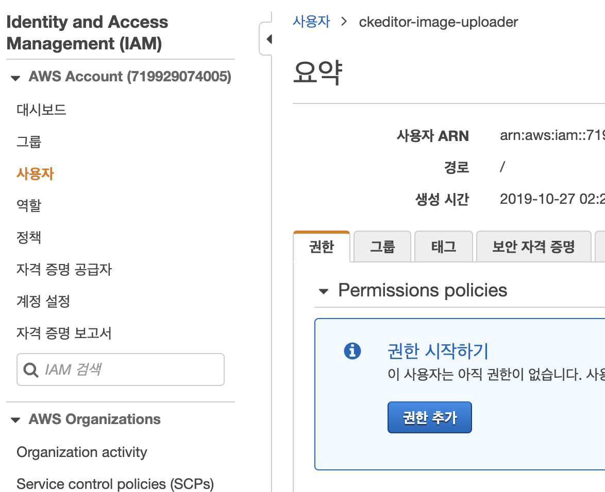

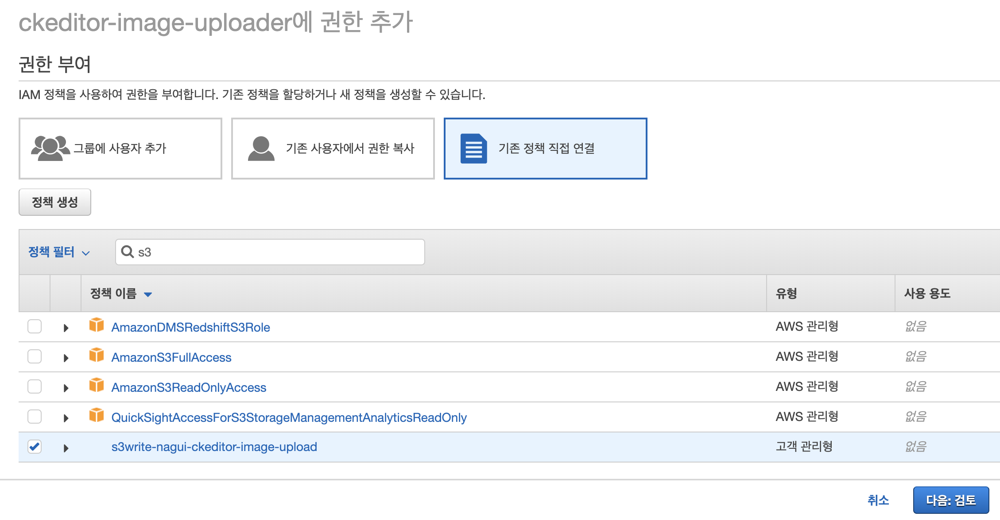

그리고 이 정책을 사용자에 연결하면 AWS에서의 설정은 완료!

## 2. NextJS Express Server

이미지를 업로드할때 이미지 파일이 거쳐가게될 경로는 `프론트` -> `서버` -> `S3` 가 될 것이다.

단순하게 본다면

`프론트`는 이미지 파일을 선택하고,

`서버`는 받은 이미지 파일을 `S3`의 어떤 버킷안의 어떤 디렉토리안에 어떤 파일명으로 업로드할 것인가 정하고 업로드 성공시 프론트로 S3의 이미지 URL을 응답하게 된다.

때문에 지난 시간에는 하지 않았던 서버구성이 필요하다.

> NextJS의 express 서버구성 예제([링크](https://github.com/zeit/next.js/tree/canary/examples/custom-server-express))를 보고 구성하면 된다.

#### (1) express 서버 구성을 위한 패키지 설치

```
# yarn add express
# yarn add --dev cross-env
```

#### (2) 서버 구동을 위한 스크립트 설정

```json
// package.json
{
    ...
    "script": {
        "dev": "node server/index.js",
        "build": "next build",
        "start": "cross-env NODE_ENV=production node server/index.js"
    },
    ...
}
```

#### (3) express 서버 소스

```js
// server/index.js
const express = require("express");
const next = require("next");

const port = parseInt(process.env.PORT, 10) || 3000;
const dev = process.env.NODE_ENV !== "production";
const app = next({ dev });
const handle = app.getRequestHandler();

app.prepare().then(() => {
    const server = express();

    // Custom Routing

    /////////////////

    server.all("*", (req, res) => {
        return handle(req, res);
    });

    server.listen(port, err => {
        if (err) throw err;
        console.log(`> Ready on http://localhost:${port}`);
    });
});
```

## 3. NodeJS Image Upload

#### (1) 이미지 업로드 기능을 만들기 위해 필요한 패키지 설치

```
# yarn add aws-sdk app-root-path multer
```

#### (2) AWS S3로 이미지 업로드 기능 구현

```js
// server/upload-image.js
const fs = require("fs");
const AWS = require("aws-sdk");
const appRoot = require("app-root-path");

const S3 = new AWS.S3({
    accessKeyId: "IMAGE_UPLOAD_AWS_ACCESS_KEY", // 위에서 생성한 IAM 유저의 ACCESS_KEY
    secretAccessKey: "IMAGE_UPLOAD_AWS_SECRET_KEY", // 위에서 생성한 IAM 유저의 SECRET_KEY
    region: "ap-northeast-2" // AWS의 대한민국 서울 리전
});

module.exports = async (file, success, fail) => {
    const today = new Date();
    const todayValue = `${today.getFullYear()}/${today.getMonth() +
        1}/${today.getDate()}`;
    const filepath = appRoot + "/" + file.path;

    const params = {
        Key: `${todayValue}/${file.filename}`, // S3에 저장될 위치(디렉토리/파일명), 존재하지 않으면 자동 생성
        Bucket: "IMAGE_UPLOAD_AWS_S3", // 위에서 생성한 AWS S3 Bucket 이름
        Body: fs.createReadStream(filepath), // 저장되는 데이터
        contentType: file.mimetype // MIME 타입
    };

    S3.upload(params, (err, data) => {
        if (err) {
            fail(err);
        }
        success(data);
    });
};
```

```js
// server/index.js
...
const multer = require("multer");
const UploadToS3 = require("./upload-image");
...

app.prepare().then(() => {
    ...
    server.post("/api/editor/imageupload*", multer({ dest: "tmp/editor/images/" }).single("upload"), (req, res) => {
        console.log(req.file);
        UploadToS3(
            req.file,
            data => {
                res.json({ uploaded: true, url: data.Location, error: null });
            },
            err => {
                res.json({ uploaded: false, url: null, error: err });
            }
        );
    });
    ...
}
```

## 4. Ckeditor5 컴포넌트 수정

#### (1) 이미지 업로드 플러그인 import & 업로드 URL 설정

`Base64UploadAdapter` 대신 `SimpleUploadAdapter`를 사용하고,

에디터 config에 `simpleUpload`를 추가한다.

```js
...
import SimpleUploadAdapter from "@ckeditor/ckeditor5-upload/src/adapters/simpleuploadadapter";
...

class App extends Component {
    render() {
        return (
            <CKEditor
                ...
                config={{
                    ...
                    simpleUpload: {
                        uploadUrl: "/api/editor/imageupload",
                        headers: {
                            "X-CSRF-TOKEN": "CSFR-Token"
                            // Authorization: 'Bearer <JSON Web Token>'
                        }
                    },
                    ...
                }}
            />
        )
    }
}
```

## 5. 마무리

#### (1) 구동

이제 `yarn dev` 명령어로 실행시켜서 업로드해보면

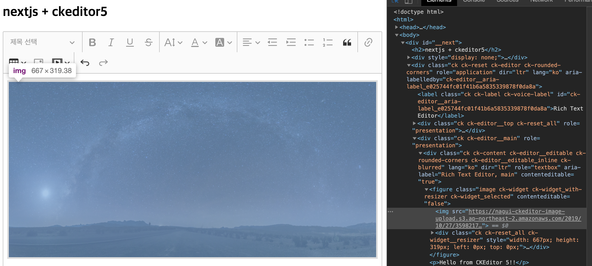

AWS S3 Bucket에 정확히 업로드된 것을 확인할 수 있다.

#### (2) 이미지 파일 관리

많은 WYSIWYG 에디터들이 이런 업로드 방식을 취하고 있고 Base64 방식에 비해 데이터베이스 관리 등이 수월하지만,

문제는 사용자가 에디터에 이미지를 업로드했다가 지웠다가 다시 업로드했다가 지웠다가 하는 등의 행동으로인해 실제로는 사용되지 않는 쓰레기 이미지들이 생성된다.

때문에 추가적인 파일관리 방안이 필요하다.

에디터의 내용을 등록할때 비동기로 이미지 주소 목록만 뽑아내서 목록 외의 파일은 삭제한다던가..

에디터 내용을 수정(onChange)할때 이미지를 삭제하는 작업만 구분해서 삭제할 이미지 목록을 만들고 등록할때 삭제처리를 해준다던가..

방안은 마련하기 나름인듯 하다.
