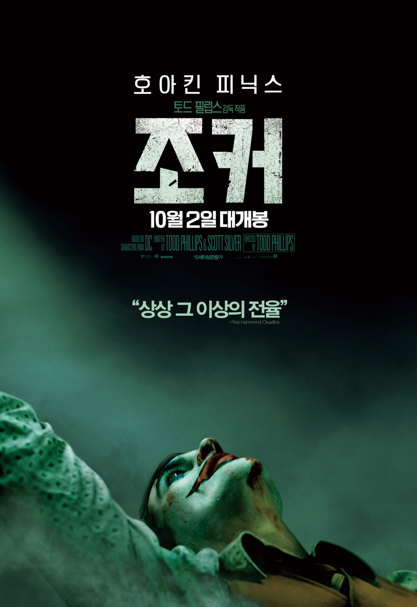

## 열린 전개와 결말

난 영화보기전에 예고편을 왠만하면 보지않고 검색도 하지않는데 조금이라도 스포당하지 않기 위함도 있지만 가장 큰 이유는 예고편만으로도 영화 내용과 기승전결이 너무 뻔히 보이는 몇몇 영화들 때문이었다.
근데 이건 너무나도 열린 전개와 열린 결말때문에 그냥 봐도 문제없었겠다 싶었다.

## “내 죽음이 내 삶보다 더 나은 가취가 있기를.”

“I hope my death will make more cents than my life.”
(번역논란에 대해서는 넘어가고..)
영화의 초반부터 후반까지 꾸준히 나오는 일기장과 개그노트에 써있는 문구다.
아서의 정신적인 문제와 남들과 다른 유머감각이 너무 잘 섞여서 표현된 문장같다.

## 관종

춤을 출때 손이 항상 뻗어나가는 것을 보며 그는 자신을 표현하고 드러내고 싶어한다고 생각했다
(한마디로 관종)
때문에 사람들이 자기 말을 안듣거나 없는 사람 취급해버리는 등 무시하면 극도의 스트레스로 병의 증세인 웃음이 나온다던가, 무섭게 정색을 해버린다, 심하면 상대방을 살해까지..

## 조커 히스레저와 조커 호아킨피닉스

영화 다크나이트의 조커역 히스레저와 이번 영화 조커의 호아킨피닉스를 비교하는거 자체가 영화 장르도 다르고 영화 조커가 DC유니버스에 포함되지않은 독립영화면서 악당 조커가 되기전 성장드라마(?)같은 내용이기때문에 말이 안될순 있는데, 주변에서 매우 많이 말하고 물어보는 부분이다.
일단 연기력은 두 배우 모두 어마어마하게 대단하다는 것은 다들 알테니 두 배우가 표현한 조커(영화 조커에서는 후반부)에 대해 내가 느낀것을 한마디로 말하자면 히스레저의 조커는 미친 천재, 호아킨 피닉스의 조커는 위에서 말했다시피 미친 관종.
히스레저의 조커는 상대방이 절대적으로 손해볼 수 밖에 없는 무기나 미끼를 가져오는 천재적인 미치광이라면 호아킨피닉스의 조커는 다른 사람의 시선에 자신의 존재를 확인하는 미치광이다.

## 정신 붙들고 관람하시길 바랍니다.

미국에서는 과거 영화 다크나이트가 상영 중인 영화관에서 조커를 흉내낸다고 총기난사 사건이 일어났던 적이 있는 만큼, 현재 조커 상영관에 입장하기전에 경찰들이 직접 소지품 검사를 한다고 한다.
(검문 사진)

영화보기전 : “영화 하나 보는데 너무 과해!”
영화본후 : “검사 무조건 해야지^^ ”

도대체 이게 왜 15세관람가인지 모르겠다.
